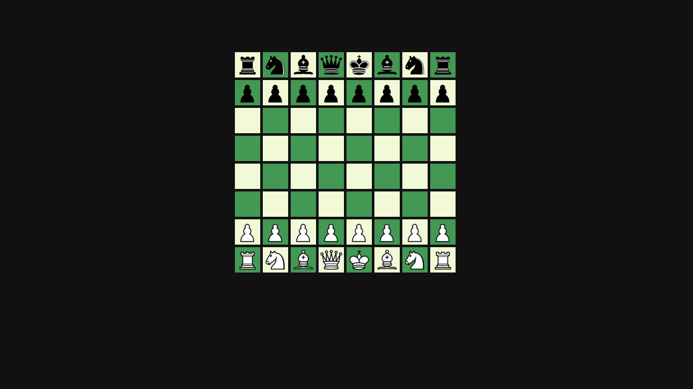
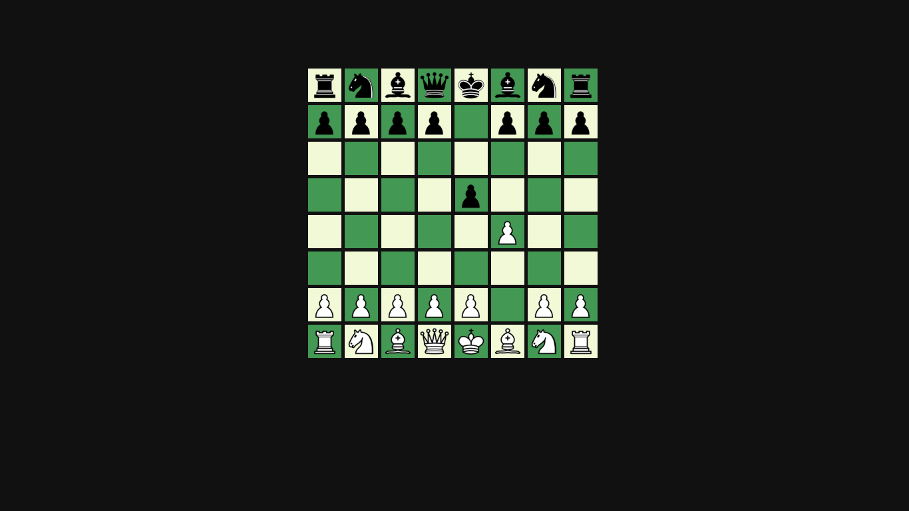
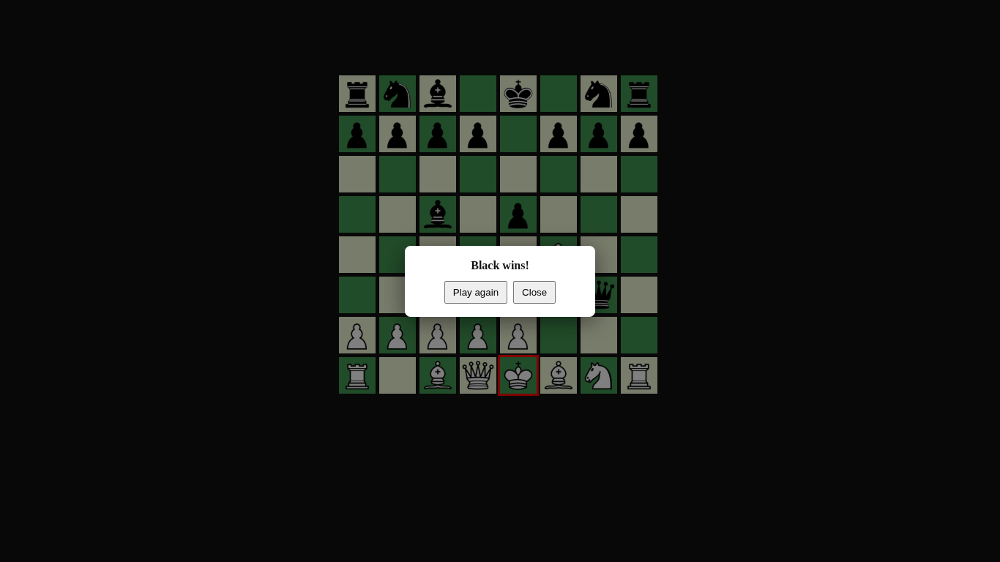

# ♟️ Chess Game

A browser-based Chess game built with JavaScript, HTML, and CSS. The project implements core chess rules, piece movement, captures, check detection, and game-over conditions in an interactive user interface.

## Features

- Complete chess board and pieces
- Legal move validation
- Piece captures
- Check and checkmate detection
- Game over modal
- Restart game functionality
- Responsive and clean UI

## Screenshots

### Initial Board



### Gameplay



### Checkmate



## Technologies Used

- HTML5
- CSS3
- JavaScript (ES6)

## Installation

```bash
git clone https://github.com/ameeradil/chess.git
cd chess
```

Open `index.html` in your browser.

## Author

**Ameer Adil**

GitHub: https://github.com/ameeradil
